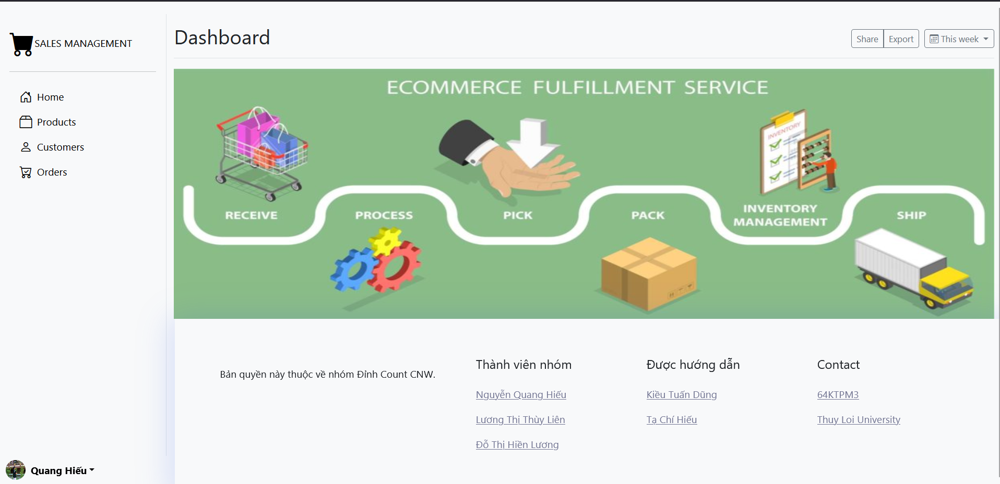
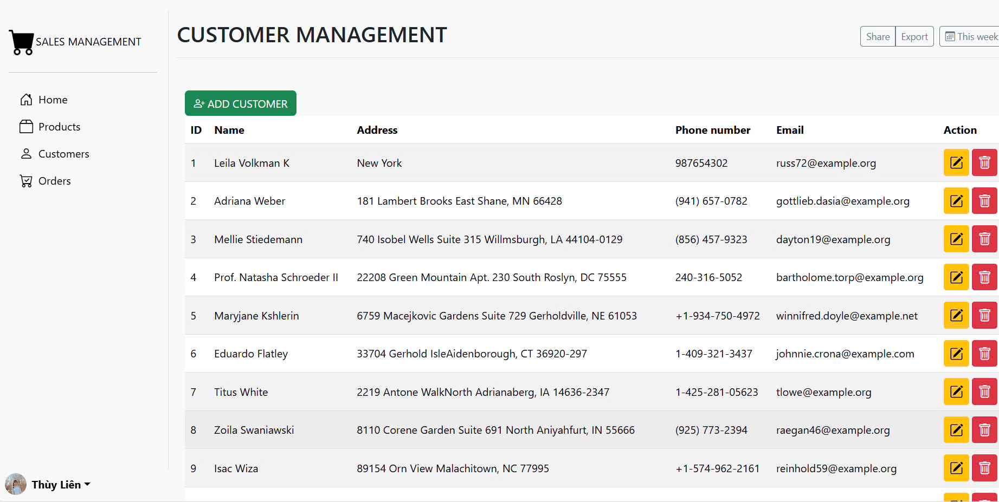
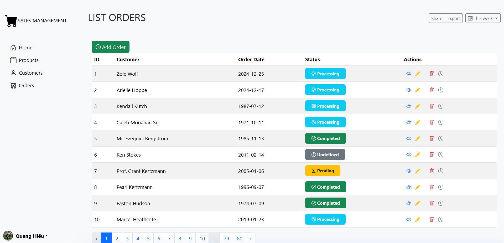
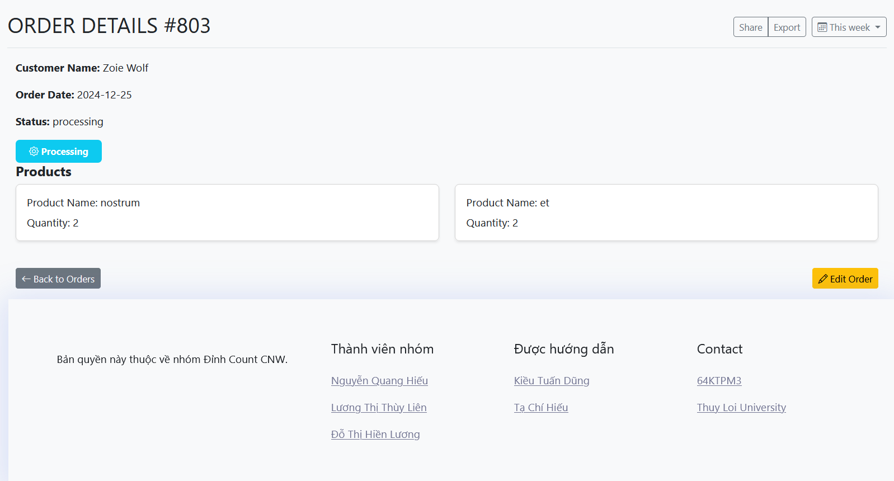

## SALES_MANAGEMENT
## 1.Quản lý sản phẩm: Lưu trữ thông tin sản phẩm: Tên sản phẩm, mô tả, giá, số lượng tồn kho.
o Cho phép thêm mới, chỉnh sửa và xóa thông tin sản phẩm.
## 2. Quản lý khách hàng: Lưu trữ thông tin khách hàng: Họ tên, địa chỉ, số điện thoại, email.
o Cho phép thêm mới, chỉnh sửa và xóa thông tin khách hàng.
## 3.Quản lý đơn hàng:Ghi nhận thông tin đơn hàng: Khách hàng, sản phẩm, số lượng, ngày đặt hàng, trạng thái đơn hàng.
o Cho phép xem lịch sử mua hàng của từng khách hàng.

## Giao diện ứng dụng

Đây là giao diện trang chủ của quản lý đơn hàng.

Đây là giao diện quản lý khách hàng.

Đây là giao diện quản lý đơn hàng

Đây là giao diện xem chi tiết đơn hàng
